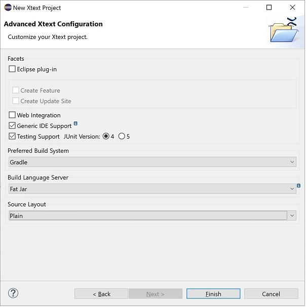
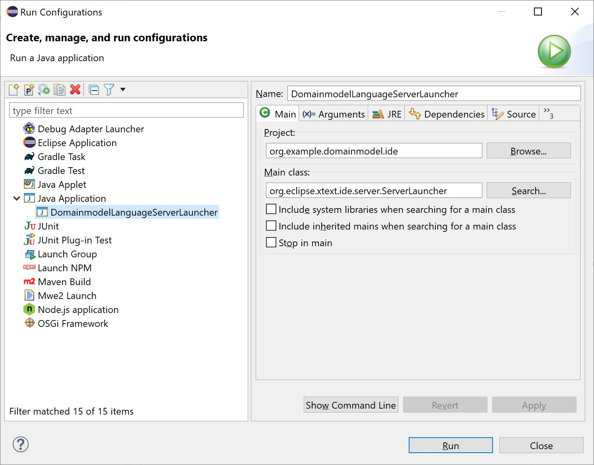
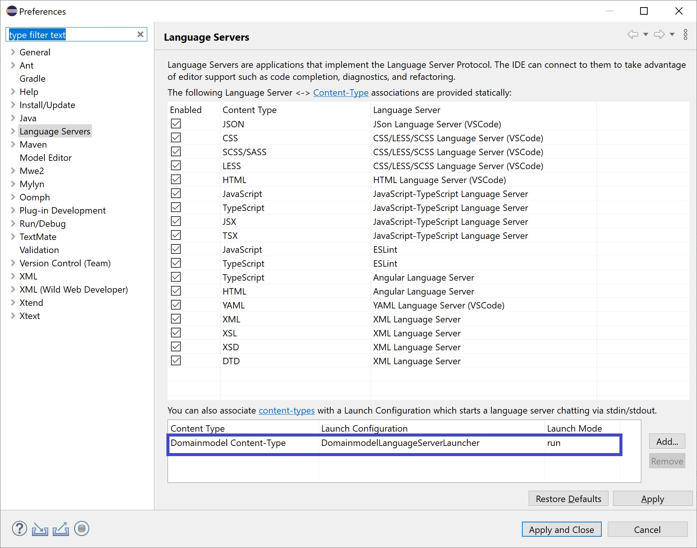
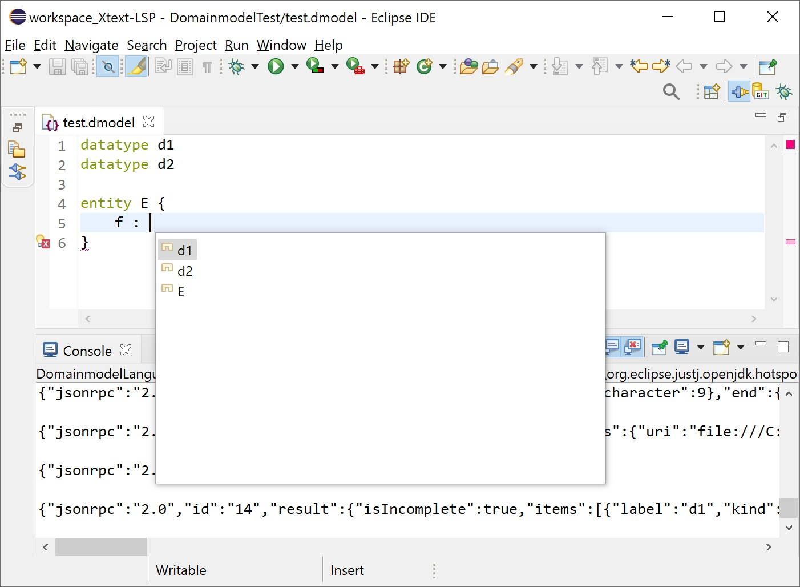

# {{page.title}} {#lsp-support}

Xtext supports the generation of language servers that comply to the [Language Server Protocol (LSP)](https://microsoft.github.io/language-server-protocol/).

## Getting Started {#getting-started}

**Step 1:** Create a new Xtext Project with language server support.


**Step 2:** Implement the Domainmodel language following the [Xtext - 15 Minutes Tutorial](https://www.eclipse.org/Xtext/documentation/102_domainmodelwalkthrough.html).

**Step 3:** Try out the Domainmodel language server in Eclipse based on [LSP4E](https://projects.eclipse.org/projects/technology.lsp4e).

 1. Configure a content type to the `*.dmodel` files:


 1. Create a launch configuration that starts the Domainmodel language server:


 1. Assign the Domainmodel content type to the Domainmodel language server launcher:


 1. LSP does not support syntax highlighting (usually it is done on the client side). The following [TextMate](https://projects.eclipse.org/proposals/tm4e-textmate-support-eclipse-ide) json file adds syntax highlighting support for the keywords, single line comments and multi-line comments of the Domainmodel language:
 ```json
{
	"name": "Domainmodel",
	"scopeName": "text.dmodel",
	"fileTypes": [
		"dmodel"
	],
	"repository": {
		"general": {
			"patterns": [
				{
					"include": "#linecomment"
				},
				{
					"include": "#blockcomment"
				},
				{
					"include": "#keyword"
				}
			]
		},
		"linecomment": {
			"name": "comment.line.double-dash.dmodel",
			"begin": "(^[ \\t]+)?(?=//)",
			"end": "(?=$)"
		},
		"blockcomment": {
			"name": "comment.block.dmodel",
			"begin": "/\\*(\\*)?(?!/)",
			"end": "\\*/"
		},
		"keyword": {
			"name": "keyword.control.mydsl",
			"match": "\\b(entity|datatype)\\b|!"

		}
	},
	"patterns": [
		{
			"include": "#general"
		}
	],
	"uuid": "8383e49a-fa0d-4bb5-827b-10e8abb294ca"
}
```
 1. Open an `*.dmodel` file with the Generic Editor and explore the supported language features like syntax highlighting, content assist, validation, quickfixes, formatting ... :


## Language Features {#language-features}

Currently, Xtext supports the following LSP language features:


|X|B|
|a|✅|
|y|:white_check_mark:|
|z|⬜️|


<table class="table table-bordered">
	<thead>
		<tr>
			<th><a href="https://microsoft.github.io/language-server-protocol/specifications/specification-current/#version_3_16_0"> LSP 3.16.0 </a> (released on 2020-12-14) <br> <a href="https://github.com/eclipse/lsp4j/blob/master/CHANGELOG.md#v0100-nov-2020"> LSP4J 0.10.0 </a>(released on 2020-11-05)</th>
			<th><a href="https://www.eclipse.org/Xtext/releasenotes.html#/releasenotes/2020/12/01/version-2-24-0"> Xtext 2.24.0 </a> <br> (released on 2020-12-01)</th>
		</tr>
	</thead>
	<tbody>
		<tr>
			<td><a href="https://microsoft.github.io/language-server-protocol/specifications/specification-current/#diagnostic">Diagnostic</a> (aka Validation)</td>
			<td><div class="supported"></div></td>
		</tr>
		<tr>
			<td><a href="https://microsoft.github.io/language-server-protocol/specifications/specification-current/#textDocument_completion">Completion</a> (aka Content Assist)</td>
			<td><div class="supported"></div></td>
		</tr>
		<tr>
			<td><a href="https://microsoft.github.io/language-server-protocol/specifications/specification-current/#snippet_syntax">Snippets</a> (aka Template Proposals)</td>
			<td><div class="supported"></div></td>
		</tr>
		<tr>
			<td><a href="https://microsoft.github.io/language-server-protocol/specifications/specification-current/#textDocument_hover">Hover</a></td>
			<td><div class="supported"></div></td>
		</tr>
		<tr>
			<td><a href="https://microsoft.github.io/language-server-protocol/specifications/specification-current/#textDocument_signatureHelp">Signature Help</a></td>
			<td><div class="supported"></div></td>
		</tr>
		<tr>
			<td><a href="https://microsoft.github.io/language-server-protocol/specifications/specification-current/#textDocument_declaration">Goto Declaration</a> (aka Hyperlinking)</td>
			<td><div class="supported"></div></td>
		</tr>
		<tr>
			<td><a href="https://microsoft.github.io/language-server-protocol/specifications/specification-current/#textDocument_definition">Goto Definition</a> (aka Hyperlinking)</td>
			<td><div class="supported"></div></td>
		</tr>
		<tr>
			<td><a href="https://microsoft.github.io/language-server-protocol/specifications/specification-current/#textDocument_typeDefinition">Goto Type Defintion</a> (aka Hyperlinking)</td>
			<td><div class="supported"></div></td>
		</tr>
		<tr>
			<td><a href="https://microsoft.github.io/language-server-protocol/specifications/specification-current/#textDocument_implementation">Goto Implementation</a> (aka Hyperlinking)</td>
			<td><div class="supported"></div></td>
		</tr>
		<tr>
			<td><a href="https://microsoft.github.io/language-server-protocol/specifications/specification-current/#textDocument_references">Find References</a></td>
			<td><div class="supported"></div></td>
		</tr>
		<tr>
			<td><a href="https://microsoft.github.io/language-server-protocol/specifications/specification-current/#textDocument_documentHighlight">Document Highlight</a> (aka Marking Occurrences)</td>
			<td><div class="supported"></div></td>
		</tr>
		<tr>
			<td><a href="https://microsoft.github.io/language-server-protocol/specifications/specification-current/#textDocument_documentSymbol">Document Symbols</a> (aka Model Elements, Outline View)</td>
			<td><div class="supported"></div></td>
		</tr>
		<tr>
			<td><a href="https://microsoft.github.io/language-server-protocol/specifications/specification-current/#textDocument_codeAction">Code Action</a> (aka QuickAssist, QuickFixes)</td>
			<td><div class="supported"></div></td>
		</tr>
		<tr>
			<td><a href="https://microsoft.github.io/language-server-protocol/specifications/specification-current/#textDocument_codeLens">Code Lens</a> (aka Code Mining)</td>
			<td><div class="not-supported"></div></td>
		</tr>
		<tr>
			<td><a href="https://microsoft.github.io/language-server-protocol/specifications/specification-current/#textDocument_documentLink">Document Link</a> (aka Hyperlinking)</td>
			<td><div class="supported"></div></td>
		</tr>
		<tr>
			<td><a href="https://microsoft.github.io/language-server-protocol/specifications/specification-current/#textDocument_documentColor">Document Color</a></td>
			<td><div class="not-supported"></div></td>
		</tr>
		<tr>
			<td><a href="https://microsoft.github.io/language-server-protocol/specifications/specification-current/#textDocument_formatting">Document Formatting</a> (aka Formatting)</td>
			<td><div class="supported"></div></td>
		</tr>
		<tr>
			<td><a href="https://microsoft.github.io/language-server-protocol/specifications/specification-current/#textDocument_rangeFormatting">Document Range Formatting</a> (aka Formatting)</td>
			<td><div class="supported"></div></td>
		</tr>
		<tr>
			<td><a href="https://microsoft.github.io/language-server-protocol/specifications/specification-current/#textDocument_onTypeFormatting">Document on Type Formatting</a> (aka Auto Editing)</td>
			<td><div class="not-supported"></div></td>
		</tr>
		<tr>
			<td><a href="https://microsoft.github.io/language-server-protocol/specifications/specification-current/#textDocument_rename">Rename</a> (aka Rename Refactoring)</td>
			<td><div class="supported"></div></td>
		</tr>
		<tr>
			<td><a href="https://microsoft.github.io/language-server-protocol/specifications/specification-current/#textDocument_foldingRange">Folding Range</a> (aka Folding)</td>
			<td><div class="not-supported"></div></td>
		</tr>
		<tr>
			<td><a href="https://microsoft.github.io/language-server-protocol/specifications/specification-current/#textDocument_selectionRange">Selection Range</a> (aka Double Click Text Selection)</td>
			<td><div class="not-supported"></div></td>
		</tr>
		<tr>
			<td><a href="https://microsoft.github.io/language-server-protocol/specifications/specification-current/#textDocument_prepareCallHierarchy">Call Hierarchy</a> </td>
			<td><div class="not-supported"></div></td>
		</tr>
		<tr>
			<td><a href="https://microsoft.github.io/language-server-protocol/specifications/specification-current/#textDocument_semanticTokens">Semantic Tokens</a> (aka Semantic Highlighting)</td>
			<td><div class="supported"></div></td>
		</tr>
		<tr>
			<td><a href="https://microsoft.github.io/language-server-protocol/specifications/specification-current/#textDocument_linkedEditingRange">Linked Editing Range</a> (aka Rename Refactoring)</td>
			<td><div class="supported"></div></td>
		</tr>
	</tbody>
</table>

## Unit Testing
Automated tests are crucial for the maintainability and the quality of a software product. That is why it is strongly recommended to write unit tests for your language server, too. Xtext provides the [org.eclipse.xtext.testing.AbstractLanguageServerTest]({{site.src.xtext_core}}/org.eclipse.xtext.testing/src/org/eclipse/xtext/testing/AbstractLanguageServerTest.xtend) base class that come in handy when implementing automated LSP unit tests. The [org.eclipse.xtext.ide.tests.server]({{site.src.xtext_core}}/org.eclipse.xtext.ide.tests/src/org/eclipse/xtext/ide/tests/server) package contains JUnit test cases for almost all supported [language features](#language-features). Feel free to study them to get some inspirations on how to implement automated unit tests for your Xtext-based language server.


**[Next Chapter: Continuous Integration](350_continuous_integration.html)**
